# CIHRMS — System Design Diagrams

> **Format:** Mermaid (renders natively on GitHub, GitLab, VS Code with the Mermaid extension, and most static site generators).
> **Companion docs:** [PRD.md](PRD.md), [TRD.md](TRD.md), [SYSTEM_ARCHITECTURE.md](SYSTEM_ARCHITECTURE.md)
> **Last revised:** 2026-05-20

This document gathers the visual system designs for CIHRMS. Diagrams are grouped by concern:

1. C4 — System Context
2. C4 — Container view
3. C4 — Component view (per high-leverage module)
4. Deployment topology
5. Request/response sequence (Inertia + Audit + 2FA)
6. Webhook / event-driven sequences
7. State machines (Payroll Run, Leave, Off-boarding, Performance Contract, Loan, Whistleblower)
8. ERD — high-level entity relationships
9. RBAC resolution flow
10. Module dependency map

---

## 1. C4 — System Context

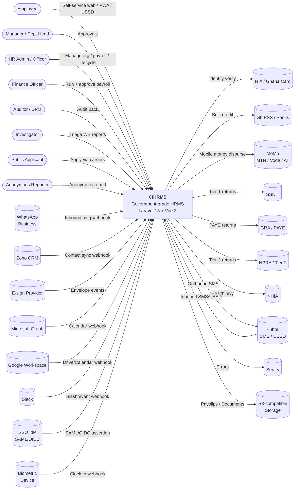

---

## 2. C4 — Container View

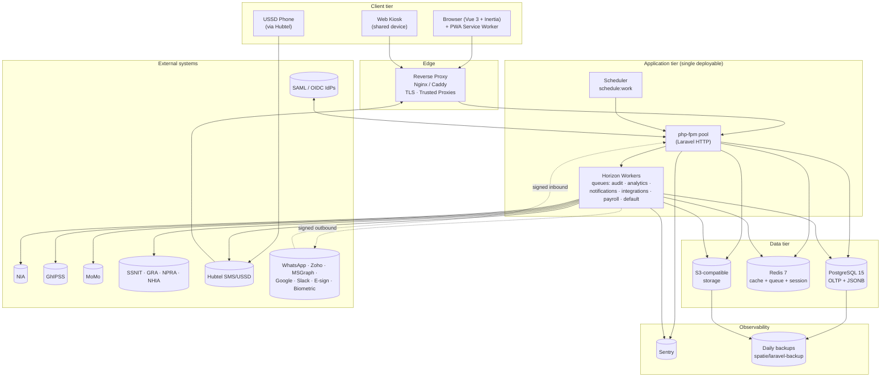

---

## 3. C4 — Component View (Payroll Module)

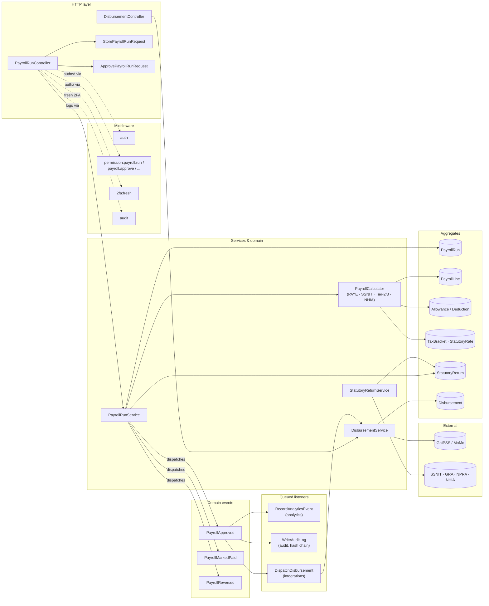

---

## 4. Deployment Topology

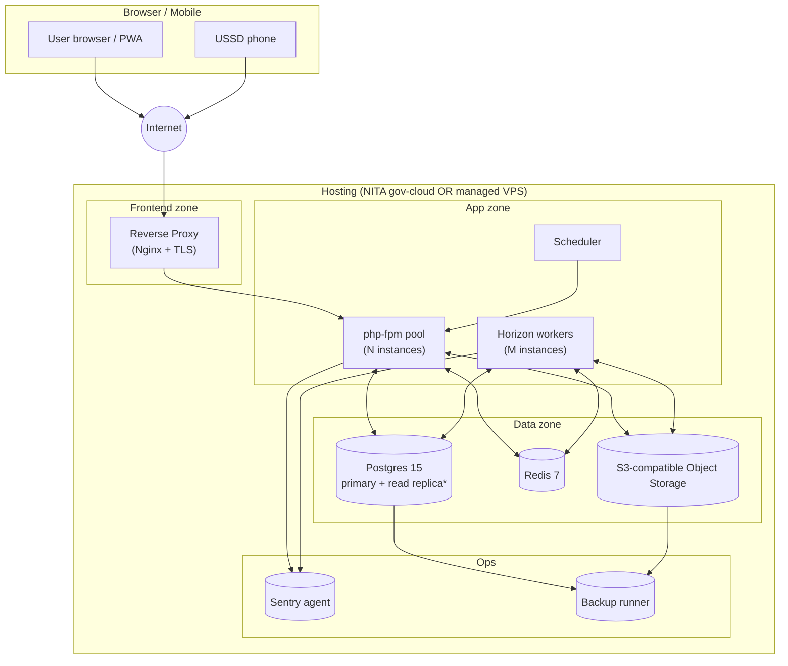

`*` Read replica is P7 (when read load justifies it).

---

## 5. Sequence — Authenticated Inertia Request (with Audit + RBAC)

```mermaid
sequenceDiagram
    autonumber
    participant U as User (Vue/Inertia)
    participant N as Nginx (TLS)
    participant L as Laravel HTTP
    participant M as Middleware Pipeline
    participant C as Controller
    participant S as Service
    participant DB as Postgres
    participant Q as Redis Queue
    participant W as Audit Worker (Horizon)

    U->>N: POST /payroll-runs/123/approve (CSRF + 2FA token)
    N->>L: forward
    L->>M: auth → permission:payroll.approve → 2fa:fresh → audit
    M-->>L: dispatch WriteAuditLog job (audit queue)
    L->>C: PayrollRunController@approve
    C->>S: PayrollRunService::approve(run, user)
    S->>DB: BEGIN; UPDATE payroll_runs SET state='approved'; ...
    S-->>S: dispatch event PayrollApproved
    S->>DB: COMMIT
    C-->>L: redirect ('payroll-runs.show')
    L-->>U: 303 + Inertia response (flash success)

    par async listeners
        Q->>W: WriteAuditLog
        W->>DB: SELECT prev_hash; INSERT audit_logs (hash=sha256(prev||row))
    and
        Q->>W: RecordAnalyticsEvent
        W->>DB: INSERT analytics_events
    and
        Q->>W: DispatchDisbursement
        W->>+External: POST /ghipss/bulk_credit
        External-->>-W: 200 OK
        W->>DB: INSERT disbursements (status=submitted)
    end
```

---

## 6. Sequence — Inbound Webhook (Biometric Clock-in)

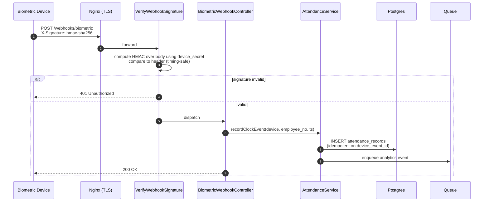

---

## 7. Sequence — Anonymous Whistleblower Submission

```mermaid
sequenceDiagram
    autonumber
    participant R as Anonymous Reporter
    participant App as Laravel App
    participant DB as Postgres
    participant Q as Queue
    participant Inv as Investigator (later)

    R->>App: POST /whistleblower<br/>(category, narrative, evidence files)
    App->>App: rate-limit 6/min<br/>(no auth required)
    App->>DB: INSERT whistleblower_reports<br/>reference = 'WB-XXXX'<br/>track_pin_hash = bcrypt(pin)
    App->>DB: INSERT whistleblower_evidence (uuid-named files)
    App-->>R: redirect /whistleblower/confirmation<br/>reference shown ONCE
    App->>Q: NotifyInvestigators (notifications)

    Note over R,App: Reporter retains reference + PIN out-of-band.

    R->>App: GET /whistleblower/track + POST { reference, pin }
    App->>DB: SELECT reports WHERE reference AND pin matches
    App-->>R: redacted status + investigator messages

    Inv->>App: POST /admin/whistleblower/{report}/triage (2fa:fresh)
    App->>DB: UPDATE status; INSERT whistleblower_actions
    Inv->>App: POST /admin/whistleblower/{report}/messages
    App->>DB: INSERT whistleblower_messages (visible to reporter via track)
```

---

## 8. State Machines

### 8.1 PayrollRun

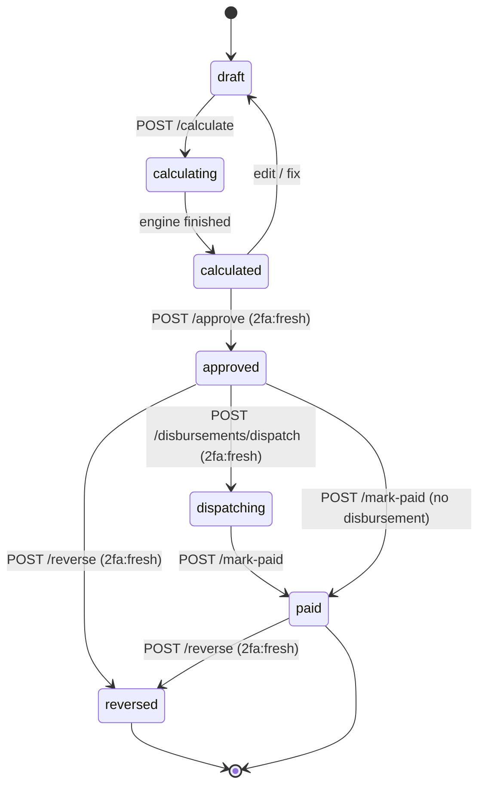

### 8.2 LeaveRequest

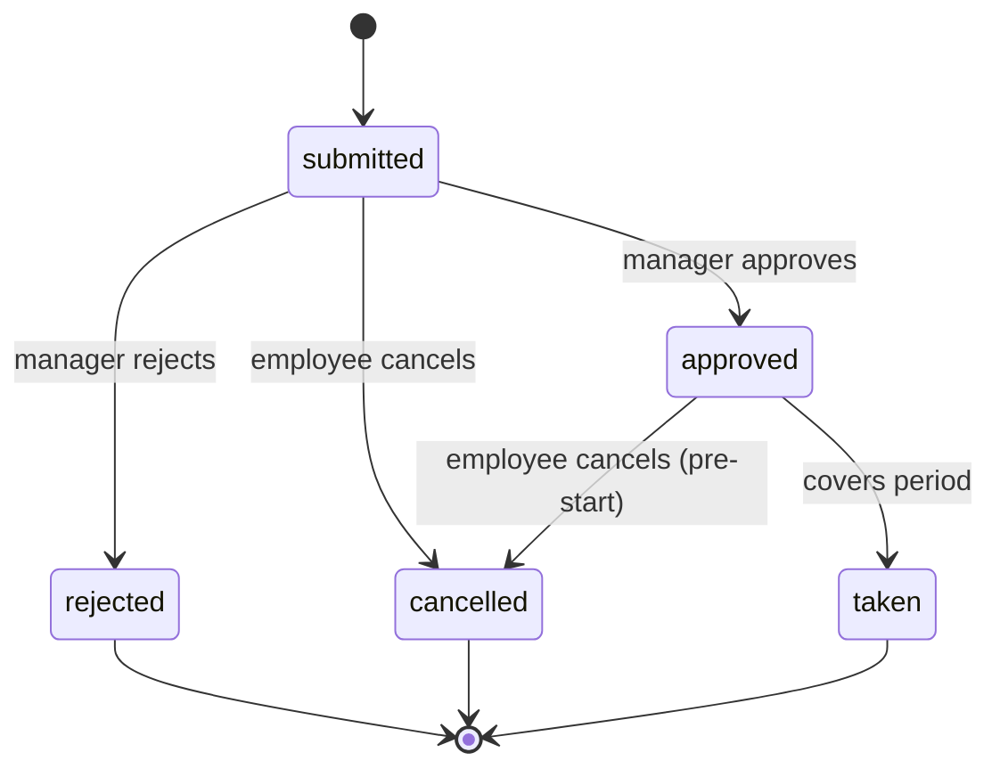

### 8.3 OffboardingCase

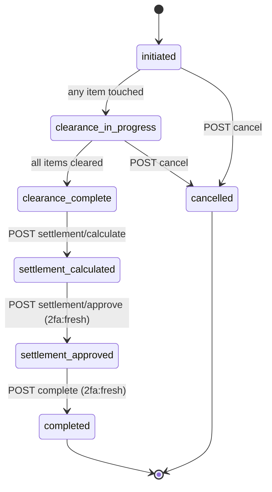

### 8.4 PerformanceContract

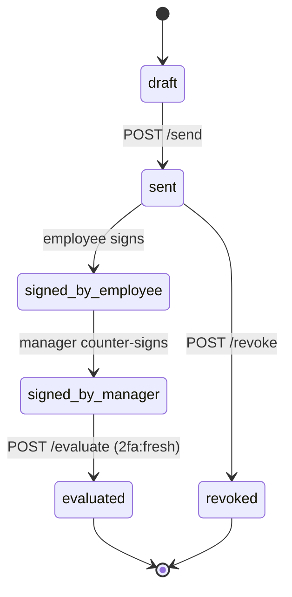

### 8.5 LoanAccount

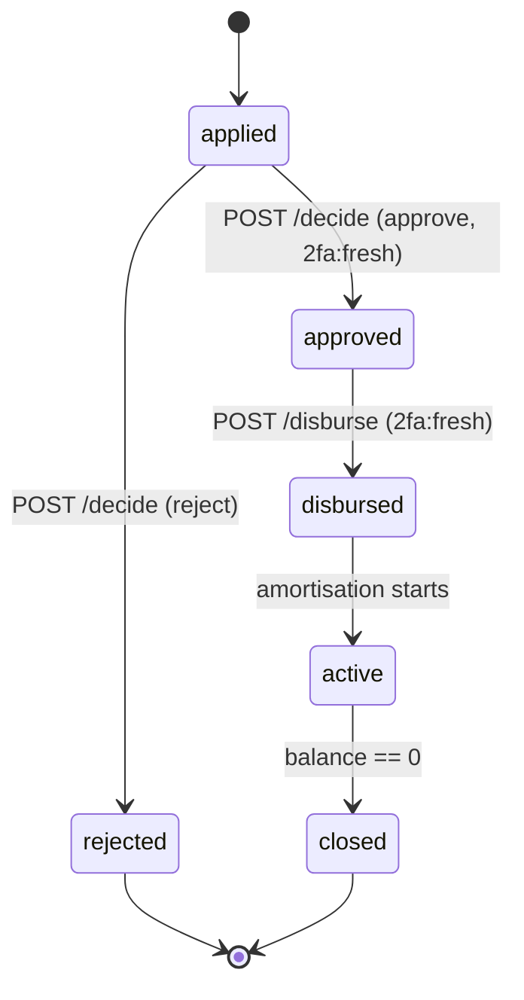

### 8.6 WhistleblowerReport

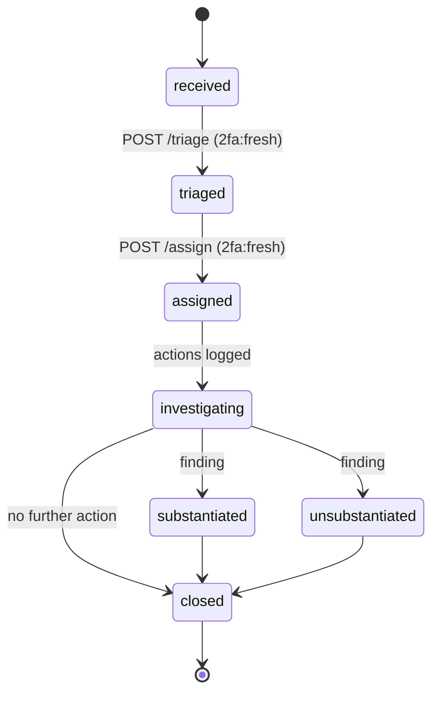

---

## 9. Entity Relationship Diagram (high-level)

> Selected core entities; full schema is in [database/migrations/](../database/migrations/).

```mermaid
erDiagram
    USER ||--o{ USER_ROLE : has
    ROLE ||--o{ USER_ROLE : assigned
    ROLE ||--o{ ROLE_PERMISSION : grants
    PERMISSION ||--o{ ROLE_PERMISSION : granted
    USER ||--o| EMPLOYEE : "linked to"
    DEPARTMENT ||--o{ EMPLOYEE : employs
    DEPARTMENT ||--o| USER : "headed by"

    EMPLOYEE ||--o{ POSITION_ASSIGNMENT : holds
    POSITION ||--o{ POSITION_ASSIGNMENT : has
    GRADE ||--o{ GRADE_STEP : contains
    POSITION }o--|| GRADE : at
    POSITION_ASSIGNMENT }o--|| GRADE_STEP : on

    EMPLOYEE ||--o{ LEAVE_REQUEST : files
    EMPLOYEE ||--o{ LEAVE_BALANCE : owns
    EMPLOYEE ||--o{ TICKET : opens
    EMPLOYEE ||--o{ COMPLAINT : files
    EMPLOYEE ||--o{ EMPLOYEE_DOCUMENT : has
    EMPLOYEE ||--o{ EMPLOYEE_SKILL : has
    EMPLOYEE ||--o{ ATTENDANCE_RECORD : clocks
    EMPLOYEE ||--o{ SHIFT_ASSIGNMENT : on
    EMPLOYEE ||--o{ GOAL : pursues
    EMPLOYEE ||--o{ REVIEW : "subject of"
    EMPLOYEE ||--o{ LOAN_ACCOUNT : holds
    EMPLOYEE ||--o{ OFFBOARDING_CASE : "subject of"
    EMPLOYEE ||--o{ IDENTITY_VERIFICATION : verified
    EMPLOYEE ||--o{ BENEFIT_ENROLMENT : enrolled
    EMPLOYEE ||--o{ ASSET_ASSIGNMENT : assigned

    REVIEW_CYCLE ||--o{ REVIEW : has
    REVIEW_CYCLE ||--o{ GOAL : "scoped to"
    GOAL ||--o{ GOAL_CHECKIN : tracks
    REVIEW_CYCLE ||--o{ PERFORMANCE_CONTRACT : produces
    REVIEW_CYCLE ||--o{ CALIBRATION_SESSION : closes
    EMPLOYEE ||--o{ PERFORMANCE_IMPROVEMENT_PLAN : on

    PAYROLL_RUN ||--o{ PAYROLL_LINE : contains
    PAYROLL_LINE }o--|| EMPLOYEE : pays
    PAYROLL_LINE ||--o{ PAYROLL_ITEM : "split into"
    PAYROLL_RUN ||--o{ STATUTORY_RETURN : produces
    PAYROLL_RUN ||--o{ DISBURSEMENT : "dispatched as"
    EMPLOYEE ||--o{ ALLOWANCE : receives
    EMPLOYEE ||--o{ DEDUCTION : owes
    PAYMENT }o--|| EMPLOYEE : "paid to"
    PAYMENT ||--o{ PAYROLL_ITEM : composed_of

    LOAN_PRODUCT ||--o{ LOAN_ACCOUNT : "issued under"
    LOAN_ACCOUNT ||--o{ LOAN_REPAYMENT : repaid

    OFFBOARDING_CASE ||--o{ CLEARANCE_ITEM : requires
    OFFBOARDING_CASE ||--|| FINAL_SETTLEMENT : settles

    DOCUMENT ||--o{ DOCUMENT_VERSION : versioned
    DOCUMENT ||--o{ DOCUMENT_ROUTE : routed
    DOCUMENT ||--o{ DOCUMENT_ANNOTATION : annotated
    DOCUMENT ||--o{ DOCUMENT_EVENT : logged

    JOB_POSTING ||--o{ APPLICANT : receives
    APPLICANT }o--|| USER : "may become"

    POLICY ||--o{ POLICY_VERSION : versioned
    POLICY_VERSION ||--o{ POLICY_ACKNOWLEDGEMENT : signed

    WHISTLEBLOWER_REPORT ||--o{ WHISTLEBLOWER_EVIDENCE : has
    WHISTLEBLOWER_REPORT ||--o{ WHISTLEBLOWER_ACTION : logged
    WHISTLEBLOWER_REPORT ||--o{ WHISTLEBLOWER_MESSAGE : conversed
    WHISTLEBLOWER_REPORT ||--o{ WHISTLEBLOWER_SUBJECT : names

    AUDIT_LOG }o--|| USER : "by"
    AUDIT_LOG ||--|| AUDIT_LOG : "prev_hash chain"

    INTEGRATION ||--o{ INTEGRATION_TOKEN : has
    INTEGRATION ||--o{ INTEGRATION_EVENT : produced
    WEBHOOK_SUBSCRIPTION ||--o{ WEBHOOK_DELIVERY : dispatched

    USER ||--o{ SSO_LOGIN_ATTEMPT : tried
    SSO_IDENTITY_PROVIDER ||--o{ SSO_LOGIN_ATTEMPT : via
    USER ||--o{ USER_IDENTITY_LINK : links
```

---

## 10. RBAC Resolution Flow

```mermaid
flowchart TD
    Start([Request hits route with<br/>middleware permission:slug]) --> Q1{User authenticated?}
    Q1 -- No --> Deny[403/redirect login]
    Q1 -- Yes --> Cache{cache hit?<br/>perms.{uid}.{slug}}
    Cache -- Hit, allow --> Allow[continue request]
    Cache -- Hit, deny --> Deny

    Cache -- Miss --> L1{user.role enum<br/>has '*' wildcard?<br/>(super_admin)}
    L1 -- Yes --> StoreAllow[cache 60s allow] --> Allow
    L1 -- No --> L2{User::ROLE_PERMISSIONS<br/>contains slug for role?}
    L2 -- Yes --> StoreAllow
    L2 -- No --> L3{DB roles via user_roles ->
roles -> role_permissions
contains slug?}
    L3 -- Yes --> StoreAllow
    L3 -- No --> L4{User.permissions JSON<br/>contains slug?}
    L4 -- Yes --> StoreAllow
    L4 -- No --> StoreDeny[cache 60s deny] --> Deny
```

For department-scoped checks, `User::managesDepartment($id)` is called inside Policies; it merges `headedDepartments` with `user_roles.department_id` pivots.

---

## 11. Domain Event Fan-out

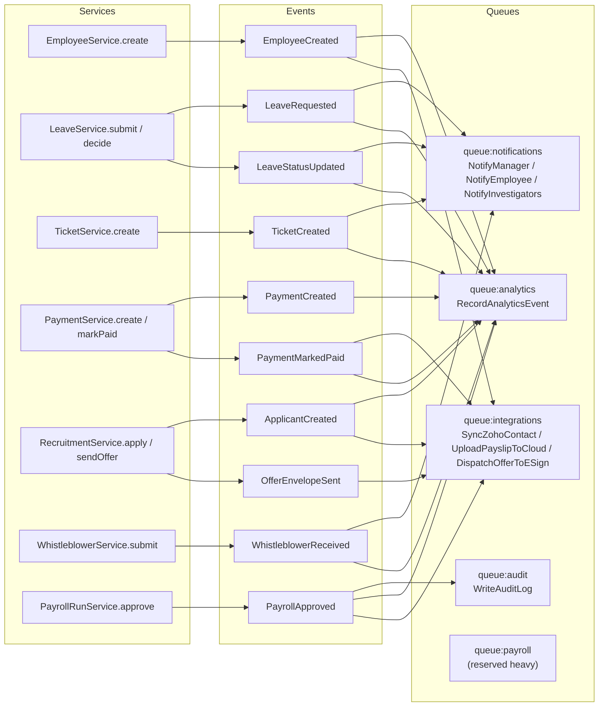

---

## 12. SSO + 2FA Login Sequence

```mermaid
sequenceDiagram
    autonumber
    participant U as User
    participant App as Laravel
    participant IdP as SAML/OIDC IdP

    U->>App: GET /auth/sso/{slug}
    App->>App: load SsoIdentityProvider
    App-->>U: 302 → IdP authorise URL (with state)
    U->>IdP: authenticate (MFA at IdP, optionally)
    IdP-->>U: redirect /auth/sso/{slug}/callback?code=...
    U->>App: GET/POST /auth/sso/{slug}/callback
    App->>IdP: exchange code (OIDC) / verify SAML assertion
    IdP-->>App: identity claims
    App->>App: lookup user_identity_links<br/>create/link user; write sso_login_attempts
    alt user has TOTP enabled
        App-->>U: 302 → /two-factor/challenge
        U->>App: POST /two-factor/challenge { code }
        App->>App: verify TOTP, set fresh-2fa marker
    end
    App-->>U: 302 → /dashboard (session established)
```

---

## 13. Module Dependency Map

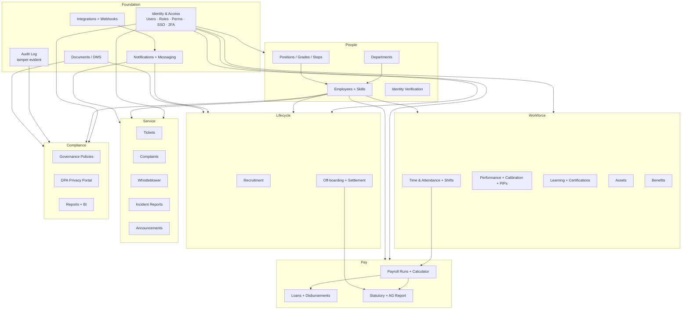

---

## 14. How to view these diagrams

- **GitHub / GitLab:** Render natively in the markdown viewer.
- **VS Code:** Install the *"Markdown Preview Mermaid Support"* extension; preview with `Ctrl+Shift+V`.
- **Locally:** Use [mermaid-cli](https://github.com/mermaid-js/mermaid-cli) — `mmdc -i SYSTEM_DESIGN_DIAGRAMS.md -o diagrams.pdf`.
- **Web:** Paste into <https://mermaid.live> to interact, export SVG/PNG.

---

## 15. Cross-References

- [PRD.md](PRD.md) — Product requirements
- [TRD.md](TRD.md) — Technical requirements
- [SYSTEM_ARCHITECTURE.md](SYSTEM_ARCHITECTURE.md) — Narrative architecture
- [PROJECT_STATE.md](PROJECT_STATE.md) — Current build status
